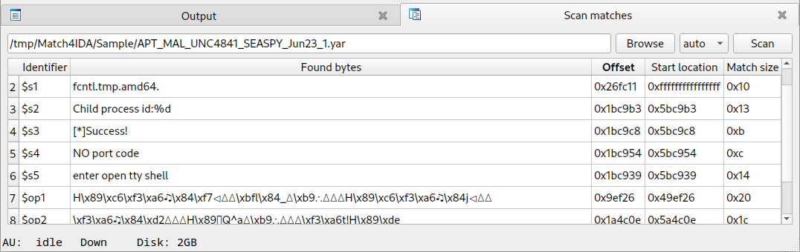

## Introduction

On a malware analysis matter, reverse engineering can initially be fed by detection rules. These rules may be specific or generic, public or private, and a quick check or an extra analysis may be required when an alert is triggered.

Scanners usually provide the offsets of the patterns found inside the analyzed sample.

**IDA** is able to jump to such file offsets, but linear addresses are the more preferred way in the software to change the current location.

As converting offsets to addresses may involve basic boring steps, this kind of computing is suitable for a Python script!

This is the aim of the **match4ida** plugin.

## Installation process

Two scanners are supported within this plugin for **IDA** :

* [YARA](https://virustotal.github.io/yara/), the famous scanner powered by VirusTotal;
* [ROST](https://www.chrysalide.re/doc/table-of-contents#rost), an alternative in early development.

Both of them are available from the [Python Package Index](https://pypi.org/) and can be installed with the following commands:

```sh
pip install yara-python
pip install pychrysalide
```

Note: both packages get compiled by **pip** on the target system, so development packages may be required. Please check their relative installation notes.

Finally, the `match4ida.py` script has to be put inside **IDA**'s `plugins` directory.

## Usage

The Python script creates a `Match4IDA` entry inside the `Edit` / `Plugins` menu.

Once activated, this entry displays a panel:



Next steps are then theses ones:
1. Select a rule using the `Browse` button or with copy/pasting.
2. Perform a scan with the `Scan` button.
3. Navigate to the location of one found pattern by clicking on its line.

## Trick to help debugging (for developpers)

To ease debugging, the code section linked to IDA can be disabled with the following commands:

```sh
$ start=$( grep -n 'class MatchPanel(idaapi.PluginForm)' match4ida.py | cut -d: -f1 )
$ end=$( grep -n 'return Match4IDA()' match4ida.py | cut -d: -f1 )
$ sed -i "$start,$end {s/^/### /}" match4ida.py
```

Scanners can then be run in a standalone way:

```sh
$ python3 ./match4ida.py APT_MAL_UNC4841_SEASPY_Jun23_1.rost Sample/3f26a13f023ad0dcd7f2aa4e7771bba74910ee227b4b36ff72edc5f07336f115
0x1bc8c8:$sx1: usage: ./BarracudaMailService <Network-Interface>. e.g.: ./BarracudaMailService eth0
0x26fc11:$s1: fcntl.tmp.amd64.
0x1bc9b3:$s2: Child process id:%d
0x1bc9c8:$s3: [*]Success!
0x1bc954:$s4: NO port code
0x1bc939:$s5: enter open tty shell
0x9ef26:$op1: H\x89\xc6\xf3\xa6\x0f\x84\xf7\x01\x00\x00\xbfl\x84_\x00\xb9\x05\x00\x00\x00H\x89\xc6\xf3\xa6\x0f\x84j\x01\x00\x00
0x1a4c0e:$op2: \xf3\xa6\x0f\x84\xd2\x00\x00\x00H\x89\xde\xbfQ^a\x00\xb9\x05\x00\x00\x00\xf3\xa6t!H\x89\xde
0x1a7484:$op3: r\xdeE\x89\xf4\xe9\xb8\xf4\xff\xffH\x8bs\x08E\x85\xe4\xbaI=b\x00\xb8D\x81b\x00H\x0fE\xd0

$ python3 ./match4ida.py APT_MAL_UNC4841_SEASPY_Jun23_1.yar Sample/3f26a13f023ad0dcd7f2aa4e7771bba74910ee227b4b36ff72edc5f07336f115
0x1bc8c8:$sx1: usage: ./BarracudaMailService <Network-Interface>. e.g.: ./BarracudaMailService eth0
0x26fc11:$s1: fcntl.tmp.amd64.
0x1bc9b3:$s2: Child process id:%d
0x1bc9c8:$s3: [*]Success!
0x1bc954:$s4: NO port code
0x1bc939:$s5: enter open tty shell
0x9ef26:$op1: H\x89\xc6\xf3\xa6\x84\xf7\xbfl\x84_\xb9H\x89\xc6\xf3\xa6\x84j
0x1a4c0e:$op2: \xf3\xa6\x84\xd2H\x89޿Q^a\xb9\xf3\xa6t!H\x89\xde
0x1a7484:$op3: r\xdeE\x89\xf4\xe9\xb8\xf4\xff\xffH\x8bE\x85\xe4\xbaI=b\xb8D\x81bHE\xd0
```

Once the core code seems suitable for use with IDA, disabling changes can be reverted with another shell command:

```sh
$ sed -i 's/^### //' match4ida.py
```

## Future features?

Some features could be a _nice-to-have_:

* Getting the sample content from the **IDA** base;
* Reloading the script without restarting **IDA**.
